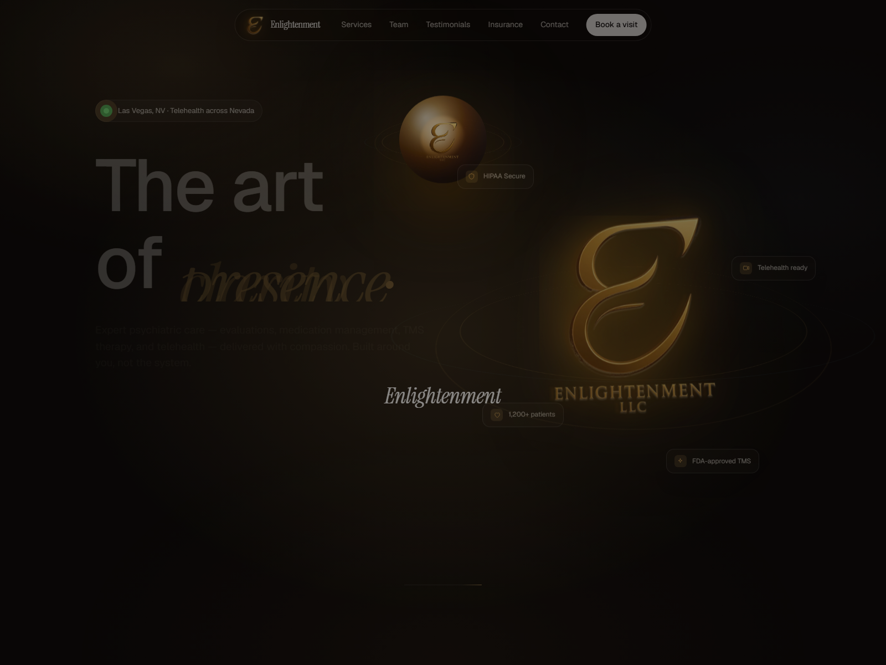
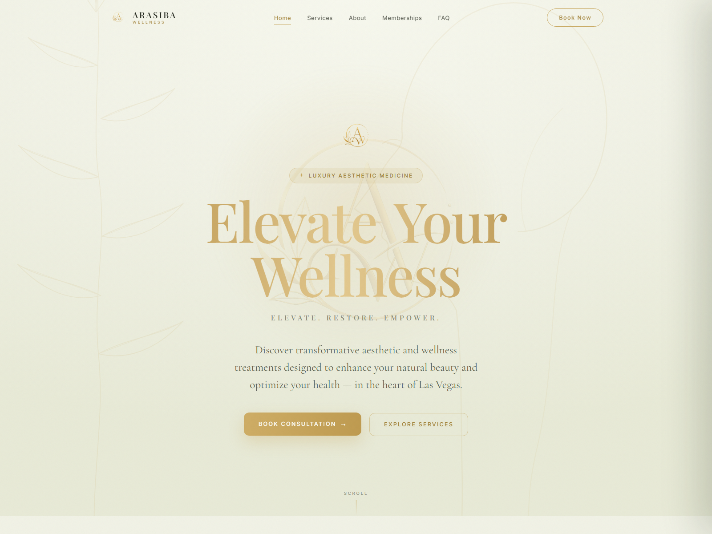
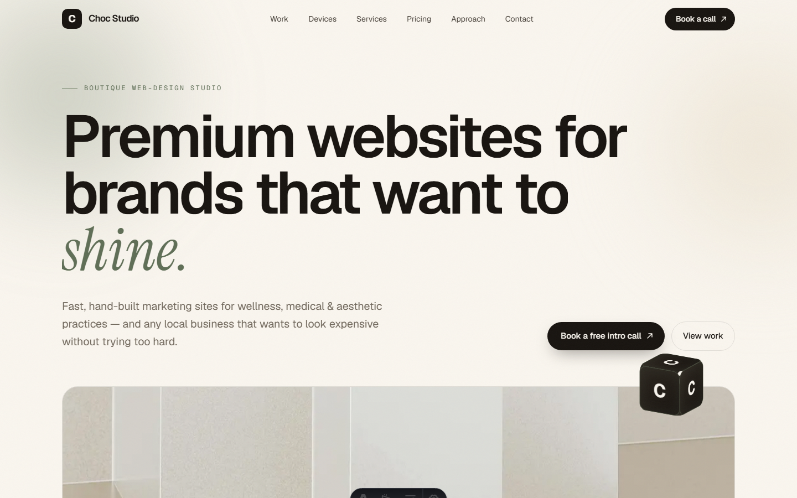
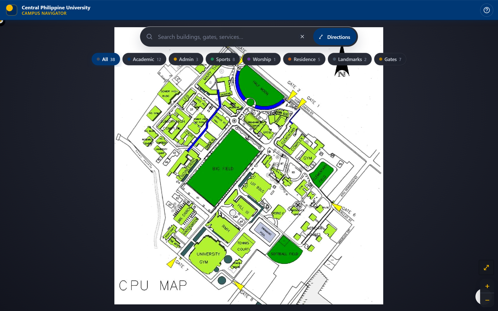

<h1 align="center">Hi, I'm Ric 👋</h1>

  <b>Web Developer • Building real sites for real clients • Web + IoT</b>

  
  
  

---

### 🧑‍💻 About Me

- 🌱 I build **websites** and tinker with **IoT** — and I learn best by *shipping real things*
- 🍫 I run a small boutique web-design studio, **Choc Studio**
- 🏢 I've designed & built **live websites for real clients** (see below 👇)
- ⚡ I love connecting **software to the physical world** — like a web app that controls a real LED
- 🎯 My goal: grow into a confident **full-stack developer**, one project at a time

---

### 🌐 Websites I've Built

Real, **live** sites I designed & built — tap any preview to visit:

<table>
  <tr>
    <td width="50%" align="center" valign="top">
      
       <b>Enlightenment LLC</b>
       Psychiatric care &amp; telehealth across Nevada — evaluations, TMS therapy &amp; counseling.
        <a href="https://www.enlightenmentllc.net">🌐 <b>Visit Site</b></a>
    </td>
    <td width="50%" align="center" valign="top">
      
       <b>Arasiba Wellness</b>
       Medical aesthetics, weight loss &amp; longevity care in Las Vegas.
        <a href="https://arasibawellness.com">🌐 <b>Visit Site</b></a>
    </td>
  </tr>
  <tr>
    <td width="50%" align="center" valign="top">
      
       <b>Choc Studio</b> 🍫
       My boutique web-design studio — fast, premium, hand-built sites.
        <a href="https://choc-studio.netlify.app">🌐 <b>Visit Site</b></a>
    </td>
    <td width="50%" align="center" valign="top">
      
       <b>CPU Campus Navigator</b>
       Interactive campus map for Central Philippine University — search, directions &amp; filters.
        <a href="https://cpumap.netlify.app">🌐 <b>Visit Site</b></a> &nbsp;·&nbsp; <a href="https://github.com/nicolasricbryant-blip/cpu-campus-map-redesign">💻 <b>Code</b></a>
    </td>
  </tr>
</table>

> 💼 Client-site source is kept private — tap **Visit Site** to see the deployed work. The CPU map is open-source (tap **Code**).

---

### 🛠️ Tech I Work With

---

### ⚡ Featured Open-Source Project

#### [First Website ni Ric — ESP32 IoT LED Controller](https://github.com/nicolasricbryant-blip/first-website-ni-ric)

> Control a **real LED from anywhere in the world** through a simple web page.

- 🔌 **Full-stack + hardware:** Node.js / Express backend, HTML + JavaScript frontend, and ESP32 firmware
- 🔄 Web button **and** a physical button stay in sync in **real time**
- 📡 Built around a small **REST API** (`/state`, `/toggle`, `/physical`)
- 🧰 **Tech:** JavaScript • Express • Arduino (C++) • REST

---

### 📊 My GitHub

  

---

### 📫 Find Me

- 🐙 GitHub: [@nicolasricbryant-blip](https://github.com/nicolasricbryant-blip)
- 🍫 Studio: [Choc Studio](https://choc-studio.netlify.app)

---

<i>⭐️ Thanks for stopping by — more projects coming as I keep building!</i>

